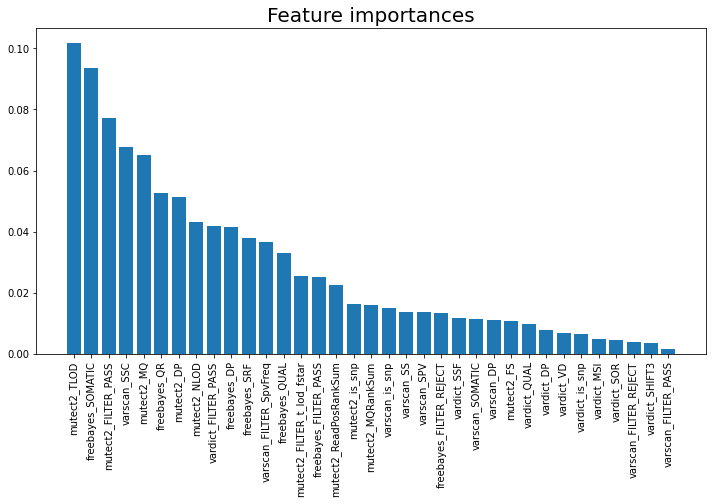

# smthcool

Random Forest Approaches
================================
This code branch contains source code that uses Random Forest algorithms trained on the the 4 variant callers, to identify relevant features as well as to predict if it is an actual mutation or not.



Environment setup
======================
Ensure Anaconda is installed before running the following commands
```
conda create -f environment.yml
conda activate cs4220_mp1
```

Experiment
===============
Ensure the VCF files and the bed files for all the datasets are made available in the HOME folder used in the iPython notebook.
Execute each of the notebooks to review the results of the experiment on each dataset. `Importance.ipynb` contains code for identifying the important features on real1. `Classification_v2.ipynb` contains code to train and test the model across the datasets.

Key Considerations
=======================
An outer join is done over all the VCF files to get the necessary combined dataframe. Here, using real1, we identify the important features from all 4 VCF files using the Random Forest approach. The rows with chromosomes beyond 1-23, X,Y are removed. Additionally features that have a NaN/infinity associated with them in the dataframe are replaced with 0 for numeric fields and -1 for binary fields, indicating they are not called by the algorithms.

Results
============

|Dataset|F1 |Precision|Recall|
|-------|---|---------|------|
|Real1|0.91|0.93|0.89|
|Real2_Part1|0.88|0.96|0.80|
|syn1|0.87|0.93|0.81|
|syn2|0.97|0.97|0.96|
|syn3|0.94|0.97|0.91|
|syn4|0.86|0.93|0.81|
|syn5|0.98|0.99|0.98|
