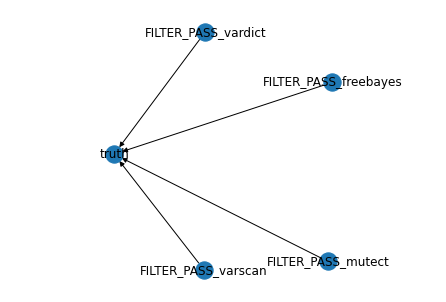

# smthcool

Probabilistic Graphical Models
================================
This code branch contains source code that uses a Bayesian Network trained on the FILTER_PASS results of each of the 4 variant callers, to predict if it is an actual mutation or not.



Environment setup
======================
Ensure Anaconda is installed before running the following commands
```
conda create -f environment.yml
conda activate cs4220_mp1
```

Experiment
===============
Ensure the VCF files and the bed files for all the datasets are made available in the dataset/ folder.
Execute each of the notebooks in the notebooks/ directory to review the results of the experiment on each dataset. `PGM_data_exploration_real2.ipynb` contains code for generating predictions on Real2_part2.

Key Considerations
=======================
Here, we only consider the field FILTER_PASS from all 4 VCF files. An outer join is done over all the VCF files to get the necessary combined dataframe. The rows that have a NaN associated with them in the dataframe are replaced with 0, indicating they are not called by the algorithms.

Results
============

|Dataset|F1 |Precision|Recall|
|-------|---|---------|------|
|Real1|0.81|0.84|0.78|
|Real2_Part1|0.78|0.73|0.84|
|syn1|0.95|0.92|0.97|
|syn2|0.95|0.92|0.97|
|syn3|0.70|0.58|0.89|
|syn4|0.65|0.63|0.67|
|syn5|0.86|0.79|0.95|
